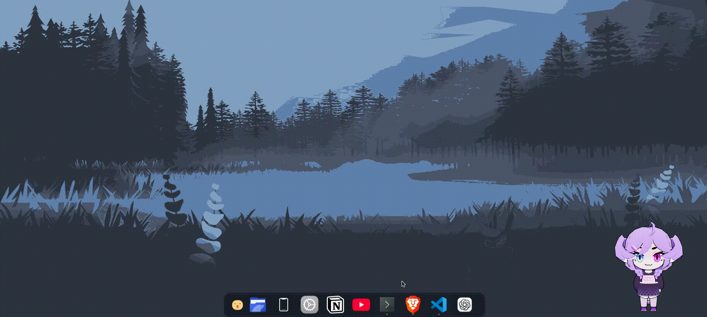
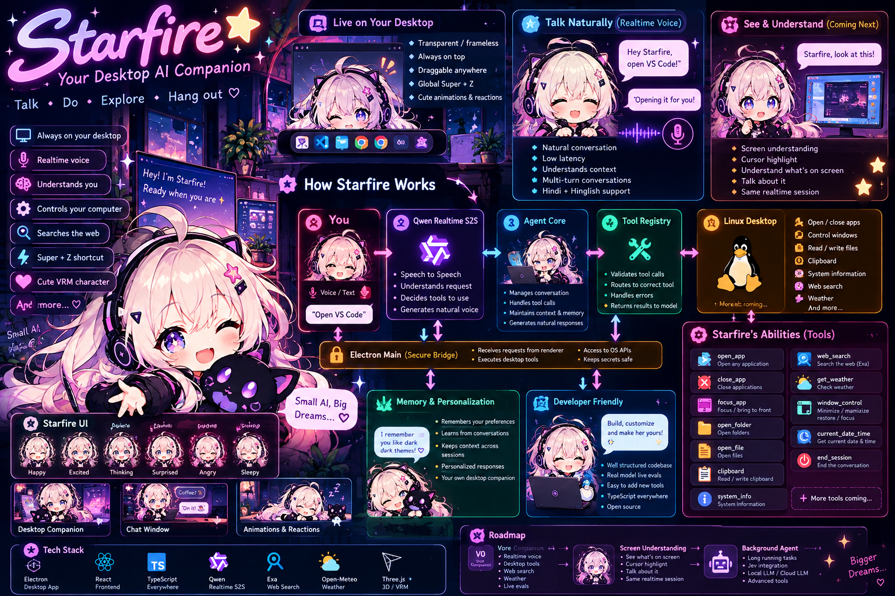
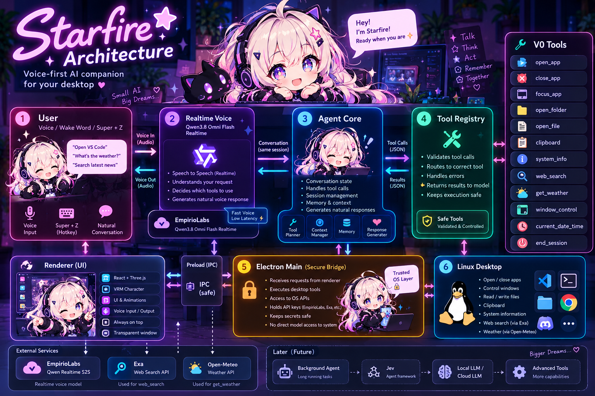

# 🌌 Starfire

<p align="center">
  
</p>

<p align="center">
  <strong>✨ An AI companion that lives on your desktop.</strong>
</p>

<p align="center">
  Talk to her. Ask her to do things. Let her see your screen.
  <br>
  <sub>Realtime voice · Desktop control · Tools · Vision · 3D companion</sub>
</p>

<p align="center">
  <a href="#-abilities">Abilities</a>
  &nbsp;·&nbsp;
  <a href="#-architecture">Architecture</a>
  &nbsp;·&nbsp;
  <a href="#-how-it-works">How it works</a>
  &nbsp;·&nbsp;
  <a href="#-quick-start">Quick Start</a>
  &nbsp;·&nbsp;
  <a href="#-development">Development</a>
</p>

<br>

<p align="center">
  
  
  
  
  
  
</p>

<p align="center">
  
  
  
</p>

---

## 🎀 Meet Starfire

**Starfire is a voice-first desktop AI companion.**

She isn't another chatbot trapped inside a browser tab.

She lives on your desktop.

Talk naturally. Ask her to perform an action. Let her search the web. Give her controlled access to desktop tools. Let her understand what's happening on your screen.

The idea is simple:

> **Make interacting with your computer feel more like talking to a companion than operating a machine.**

<br>

<p align="center">
  
</p>

---

## ✨ Abilities

Starfire is built around **doing**, not just talking.

| | Capability | What it means |
|---|---|---|
| 🎙️ | **Realtime Voice** | Talk naturally using realtime speech-to-speech interaction |
| 🖥️ | **Desktop Control** | Interact with supported desktop capabilities through controlled tools |
| 📂 | **Files & Folders** | Open files and folders without manually navigating your filesystem |
| 📋 | **Clipboard** | Read and write clipboard content |
| 🌐 | **Web Search** | Search the web when external information is needed |
| 🌦️ | **Context** | Access weather, date, time and system information |
| 🪟 | **Window Control** | Focus, minimize and close supported application windows |
| 🎭 | **VRM Companion** | React through a realtime 3D character |
| ⌨️ | **Global Shortcut** | Quickly interact using `Super + Z` |
| 👀 | **Screen Understanding** | See and reason about what's currently on your screen |

---

## 🛠️ Tools

Starfire does not receive unrestricted access to your computer.

Instead, capabilities are exposed through an explicit **tool registry**.

```text
┌─────────────────────────────────────────┐
│             STARFIRE TOOLS              │
├─────────────────────────────────────────┤
│                                         │
│  🖥️  open_app                           │
│  🖥️  close_app                          │
│  🎯  focus_app                          │
│                                         │
│  📂  open_folder                        │
│  📄  open_file                          │
│                                         │
│  📋  clipboard                          │
│  💻  system_info                        │
│                                         │
│  🌐  web_search                         │
│  🌦️  get_weather                        │
│                                         │
│  🪟  window_control                     │
│  🕐  current_date_time                  │
│                                         │
│  🛑  end_session                        │
│                                         │
└─────────────────────────────────────────┘
```

### 💬 Talk to her like this

```text
"Open VS Code."

"Bring Chrome to the front."

"What's in my clipboard?"

"What's the weather today?"

"Search for the latest React news."

"Minimize this window."

"Open my projects folder."

"Close Discord."
```

The model decides **when a tool is needed**.

The tool registry decides **what the model is actually allowed to do**.

---

# 🧠 How It Works

At the highest level:

```text
                         🎙️ YOU
                            │
                            │  "Open VS Code"
                            ▼
                  ┌──────────────────┐
                  │   Realtime S2S   │
                  │      Model       │
                  └────────┬─────────┘
                           │
                           ▼
                  ┌──────────────────┐
                  │     STARFIRE     │
                  │    Agent Core    │
                  └────────┬─────────┘
                           │
                     Tool Decision
                           │
                           ▼
                  ┌──────────────────┐
                  │  Tool Registry   │
                  └────────┬─────────┘
                           │
              ┌────────────┼────────────┐
              ▼            ▼            ▼
           🖥️ Desktop     🌐 Web      📂 Files
              │            │            │
              └────────────┼────────────┘
                           ▼
                        🎀 DONE
```

The system separates:

- 🎨 Interface
- 🎙️ Realtime communication
- 🧠 Agent logic
- 🛠️ Tool execution
- 🔐 Privileged desktop access
- 📦 Shared contracts

This keeps the core small, testable and extensible.

---

# 🌌 Architecture

<p align="center">
  
</p>

Starfire is structured as a modular desktop agent rather than one giant application.

```text
Starfire
│
├── apps/
│   │
│   ├── desktop/
│   │   ├── Electron
│   │   ├── React
│   │   ├── Realtime voice
│   │   ├── VRM interface
│   │   └── Desktop integration
│   │
│   └── core/
│       ├── Agent
│       ├── Session
│       └── Tool execution
│
├── packages/
│   │
│   ├── contracts/
│   │   └── Shared types
│   │
│   └── tools/
│       ├── Tool registry
│       ├── Desktop tools
│       ├── Web tools
│       └── System tools
│
├── eval/
│   ├── Scenarios
│   ├── Tool evaluation
│   ├── Live evaluation
│   └── Metrics
│
├── docs/
│   └── Architecture notes
│
└── public/
    ├── sf.gif
    ├── abilities.png
    └── architecture.png
```

---

# 🔐 Built With Guardrails

Desktop AI is powerful.

Giving an AI unrestricted access to a machine is also a terrible security boundary.

Starfire deliberately uses **explicit capabilities instead of raw system access**.

```text
                       🤖 AI MODEL
                            │
                            ▼
                    ┌─────────────┐
                    │ TOOL CHECK  │
                    └──────┬──────┘
                           │
                  ┌────────┴────────┐
                  ▼                 ▼
            Allowed Tool        Unknown Action
                  │                 │
                  ▼                 ▼
              Execute             Reject
```

Starfire does **not** expose unrestricted:

```text
sudo
rm -rf
arbitrary shell commands
unrestricted process execution
destructive system operations
```

The React renderer remains isolated from privileged operations.

Secrets and sensitive desktop capabilities stay on the trusted Electron side.

> **Give the AI capabilities — not the entire operating system.**

---

# 🧪 Evaluation

A desktop AI can look incredible in a demo and still fail the moment a real user gives it an ambiguous request.

Starfire therefore includes evaluation as part of the system itself.

### Run checks

```bash
pnpm check
pnpm build
```

### Run the evaluation suite

```bash
pnpm eval
```

### Run live model evaluation

```bash
pnpm eval:live
```

### 📊 What gets measured?

| Metric | Purpose |
|---|---|
| 🎯 **Tool Selection** | Did Starfire choose the correct capability? |
| ✅ **Task Success** | Did the requested action actually complete? |
| 💬 **Response Quality** | Was the response useful and appropriate? |
| 🛡️ **Reliability** | Did the system behave consistently? |
| ⚡ **Latency** | How quickly did the interaction complete? |
| 💰 **Cost** | How much model usage was required? |

Evaluation scenarios include:

```text
Simple requests
       ↓
Ambiguous requests
       ↓
Multi-turn conversations
       ↓
Tool failures
       ↓
Invalid requests
       ↓
Realistic desktop tasks
```

---

# 👀 Screen Understanding

One of the next major interaction layers is **vision**.

Imagine saying:

> **"Starfire, look at this."**

Starfire can capture the screen, include cursor context, and send the visual information into the same realtime interaction.

```text
                    👤 YOU
                      │
                      │
             "Look at this."
                      │
                      ▼
             ┌────────────────┐
             │ look_at_screen │
             └───────┬────────┘
                     │
                     ▼
                🖥️ Screenshot
                     +
                🖱️ Cursor
                     │
                     ▼
             ┌────────────────┐
             │ Realtime Model │
             └───────┬────────┘
                     │
                     ▼
                 🎀 STARFIRE
                     │
                     ▼
               "I can see..."
```

The screen becomes another input modality for the same conversational experience.

---

# 🧠 From Assistant → Agent

The current system intentionally keeps the realtime layer lightweight.

The architecture is designed so larger agent workflows can grow around it.

```text
                         BIG TASK
                            │
                            ▼
                   ┌─────────────────┐
                   │ Background Agent│
                   └────────┬────────┘
                            │
                            ▼
                           Jev
                            │
                   ┌────────┴────────┐
                   ▼                 ▼
              Local LLM          Cloud LLM
                   │                 │
                   └────────┬────────┘
                            ▼
                          Tools
                            │
                            ▼
                         Desktop
```

The long-term direction is:

```text
Conversation
     ↓
Reasoning
     ↓
Tool selection
     ↓
Execution
     ↓
Verification
```

while keeping capabilities explicit and observable.

---

# 🚀 Quick Start

## Requirements

```text
Linux
Node.js
pnpm
Git
```

## 1. Clone

```bash
git clone https://github.com/neugence/starfire.git
cd starfire
```

## 2. Install

```bash
pnpm install
```

## 3. Configure environment

Create:

```text
apps/desktop/.env
```

Add:

```env
EMPIRIOLABS_API_KEY=your_key_here
EXA_API_KEY=your_key_here
```

## 4. Run

```bash
pnpm dev
```

Starfire should launch as a desktop application. 🎀

---

# 🧰 Development

| Command | Purpose |
|---|---|
| `pnpm install` | Install dependencies |
| `pnpm dev` | Start development |
| `pnpm check` | Run project checks |
| `pnpm build` | Build the project |
| `pnpm eval` | Run evaluation suite |
| `pnpm eval:live` | Run live model evaluation |

---

# 📁 Project Structure

```text
Starfire/
│
├── apps/
│   ├── desktop/
│   └── core/
│
├── packages/
│   ├── contracts/
│   └── tools/
│
├── eval/
├── docs/
│
├── public/
│   ├── sf.gif
│   ├── abilities.png
│   └── architecture.png
│
├── package.json
├── pnpm-workspace.yaml
└── README.md
```

---

# 💫 The Philosophy

Most assistants are applications you **open**.

Starfire is designed to be something that's simply **there**.

```text
                         YOUR DESKTOP
                              │
             ┌────────────────┼────────────────┐
             │                │                │
           Apps             Files             Web
             │                │                │
             └────────────────┼────────────────┘
                              │
                       ┌──────▼──────┐
                       │   STARFIRE  │
                       │      ✨     │
                       └──────┬──────┘
                              │
                       Voice + Vision
                              │
                              ▼
                             YOU
```

You shouldn't have to think:

> "Which application do I open?"

You should be able to think:

> **"Starfire, do this."**

---

# 🎀 Starfire

**A desktop companion.**

**A realtime voice interface.**

**A tool-using AI.**

**A visual character.**

And eventually, something that feels less like software you operate...

...and more like an AI that **lives alongside your computer.**

---

# 💜 Project Status

Starfire is currently in **early experimental development**.

The system is intentionally evolving one capability at a time.

```text
Voice
  ↓
Tools
  ↓
Desktop
  ↓
Vision
  ↓
Memory
  ↓
Agents
```

The foundation stays small.

The possibilities don't.

---

<p align="center">
  
</p>

<h2 align="center">🌌 Starfire</h2>

<p align="center">
  <strong>A little AI companion for your desktop.</strong>
  <br>
  <sub>Built with TypeScript · Electron · React · Three.js</sub>
</p>

<p align="center">
  <a href="https://github.com/StarDust130/starfire">
    
  </a>
</p>

<p align="center">
  <sub>Made with code, curiosity, and a little ✨</sub>
</p>
